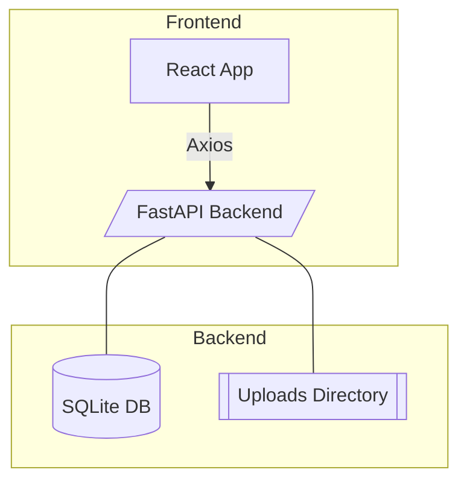

# Architecture Overview

1. **React + Vite Frontend**
   - Handles file selection and uploads via Axios.
   - Displays computed metrics and history list.
   - Built into static files served by Nginx inside `frontend` container.

2. **FastAPI Backend**
   - `/upload/` saves file to `uploads/`, computes metrics, stores record in SQLite.
   - `/results/{file_id}` fetches stored metrics.
   - `/history/` returns recent documents.

3. **Database**
   - Async SQLAlchemy with SQLite (swap-able).
   - Single `documents` table.

4. **Docker Compose**
   - `backend` container (Uvicorn).
   - `frontend` container (Nginx serving built React bundle).
   - Shared network so frontend calls backend at `http://backend:8000` when deployed (React build step sets VITE_API_URL or we keep same host via compose hostname mapping).

## Data Flow
1. User uploads file → frontend sends `multipart/form-data` POST to backend.
2. Backend validates, stores, runs analysis service.
3. Metrics returned instantly → frontend renders table + word list.
4. History sidebar refreshed via `/history/`.

---

## Metrics Calculations
- **Total / unique word count**: basic tokenization splitting on non-letters.
- **Average sentence length**: mean words per `.` `!` or `?` sentence.
- **Flesch-Kincaid**: standard formula using syllable estimator.
- **Top 10 words**: stop-word-filtered frequency.
